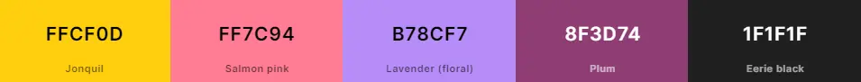
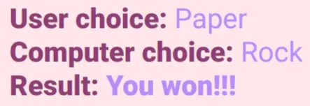
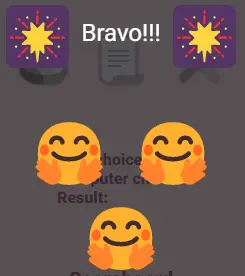
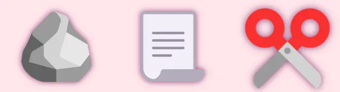
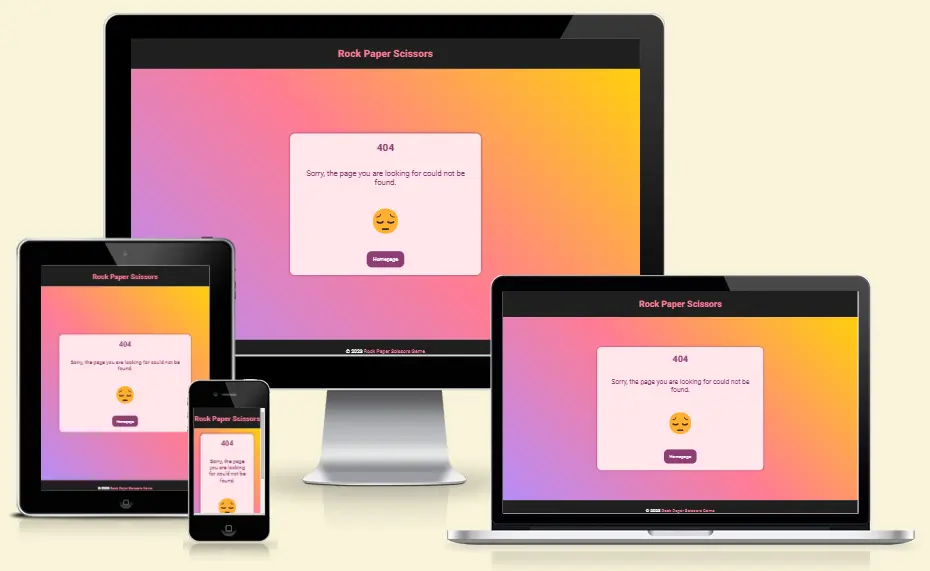

# Rock Paper Scissors Game

[Rock Paper Scissors Game](https://radule90.github.io/CI_PP_2/) is a simple game. Where the user chooses his choice and immediately receives a random response from the opponent (computer) together with the result of the game. The winner is decided by the number of wins, the first to win 10 times is the winner of the game.

***
## Table of Contents
1. 

    
<a href="#ux">UX</a>

      - [Visitor Goals](#visitor-goals)
      - [Business Goals](#business-goals)
      - [User Stories](#user-stories)

2. 

    
<a href="#visual-design">Visual Design</a>

      - [Wireframes](#wireframes)
      - [Colors](#colors)
      - [Fonts](#fonts)
      - [Icons](#icons)

3. 

    
<a href="#styling-formating-and-features">Styling, Formating and Features</a>

      - [Head Section](#head-section)
      - [Header Section](#header-section)
      - [Game Section](#game-section)
      - [Footer Section](#footer-section)
      - [HTTP 404 Page](#http-404-page)
      - [Future Features](#future-features)

4. 

    
<a href="#validation-and-testing">Validation and Testing</a>

    <ul>
    <li><a href="#html-validation">HTML Validation</a></li>
    <li><a href="#css-validation">CSS Validation</a></li>
    <li><a href="#accessibility">Accessibility</a></li>
    <li>
      

      
<a href="#testing">Testing</a>

      - [General Testing](#general-testing)
      - [Desktop Testing](#desktop-testing)
      - [Mobile](#mobile-testing)

      

    </li>
    <li>
      

      
<a href="#bugs">Bugs</a>

      
      - [Fixed Bugs](#fixed-bugs)
      - [Unfixed Bugs](#unfixed-bugs-partialy-fixed)
      

    </li>
    </ul>    

  
5. <a href="#deployment">Deployment</a> 
6. <a href="#credits">Credits</a>
7. <a href="#tools-and-platforms">Tools and Platforms</a>
8. <a href="#content">Content</a>
9. <a href="#media">Media</a>

***
## UX
### Visitor Goals

### Business Goals

### User Stories

***
## Visual Design
### Wireframes

### Colors
- Since this game is basically simple, I wanted to add to the dynamism of the site with various colors for fonts/backgrounds and sharper transitions between sections.
- As a result, you may see different shades of pink/purple, yellow, black and red.
- However, I made sure that everything was readable.
- Colour contrast was first verified on [WebAIM](https://webaim.org/resources/contrastchecker/).  

### Fonts
- I used a lot of different colors for the background and the letters, so I decided on just one font: Roboto from [Google Fonts](https://fonts.google.com/specimen/Roboto?query=roboto).
- This font is quite clear, legible, simple but still looks cool.  

### Icons
- Icons, or rather emojis, used on the site are taken from [Get Emoji](https://getemoji.com/).
- They seemed very interesting, even though they are displayed differently on different devices/applications, which can be annoying, but again, I think all of their variants look nice.  

- I also used the rock, paper, scissors emojis to create a favicon with the help of [GIMP](https://www.gimp.org/) and [Favicon Generator](https://www.favicon-generator.org/).  

***
## Styling, Formating and Features

### Head Section

### Header Section

### Game Section

### Footer Section

### HTTP 404 Page
- As a small addition I designed and developed an 404 HTTP error page.
- I kept the header and footer of the main page, without Rules of the game in footer section.
- I didn't want to be it too complicated, because there should be a simple message on this page. Using the same color palette and fonts I added an error message card and an additional link to the main page.

- [Here you can find broken link as example for 404 page.](https://radule90.github.io/CI_PP_2/11)

### Future Features

***
## Validation and Testing
### HTML Validation

### CSS Validation

### Accessibility

### Testing
#### General Testing

#### Desktop Testing

#### Mobile Testing

### Bugs
### Fixed Bugs

### Unfixed Bugs (Partialy Fixed)

***
## Deployment
This site was deployed through GitHub Pages using the following steps:
1. Sign in to the GitHub website.
2. In the GitHub project repository, navigate to the Settings tab, then choose Pages from the menu
3. From the Build and deployment section select Branch: main and then save.
4. After about a minute, refresh the page and under GitHub Pages you will see a link.

The live link can be found here: [Rock Paper Scissors Game](https://radule90.github.io/CI_PP_2/).

***
## Credits
- [Code Institute](https://codeinstitute.net/de/)
- Rory Patrick Sheridan (Mentor) - Great advice and guidance
- [Mozilla Developer Networks](https://developer.mozilla.org/en-US/) - Additional learning resources
- [W3Schools](https://www.w3schools.com) - Additional learning resources
- [CSS-Tricks](https://css-tricks.com) - Additional learning resources
- [Dave Gray](https://www.youtube.com/c/DaveGrayTeachesCode) - Additional learning resources
- [Kevin Powell](https://www.youtube.com/@KevinPowell) - Additional learning resources
- [BrowserStack](https://www.browserstack.com/) - Website Testing on iOS

***
## Tools and Platforms
- [Gitpod](https://gitpod.io/) - IDE for project development
- [Github](https://github.com/) - Storing code remotely and deployment
- [JSHint](https://jshint.com/) - JSHint, a JavaScript Code Quality Tool
- [W3C Markup Validation Service](https://validator.w3.org)
- [W3C CSS Validation Service](https://jigsaw.w3.org/css-validator/)
- [CSS Autoprefixer](https://autoprefixer.github.io/) - Autoprefixer CSS online
- [Coolors.co](https://coolors.co/) - Palette generator
- [Balsamiq Wireframes](https://balsamiq.com/) - To create wireframes
- [WebAIM](https://webaim.org/resources/contrastchecker/) - Contrast checker
- [Am I Responsive](https://ui.dev/amiresponsive) - For device mockup images
- [Favicon Generator](https://www.favicon-generator.org/)
- [BrowserStack](https://www.browserstack.com/) - Testing on different devices
- [Google Fonts](https://fonts.google.com)
- [Get Emoji](https://getemoji.com/) - Icons/Emojis
- [FireShot: Full Webpage Screenshots + Annotations](https://getfireshot.com/) - Screen Capture
- [cloudconvert](https://cloudconvert.com/png-to-webp) - Online png to webp converter
- [GIMP](https://www.gimp.org/) - Raster graphics editor

***
## Content
- The following three tutorials helped me arrive at the final code solution
    - [3 ways to code Rock Paper Scissors in JavaScript (Beginner to Intermediate to Advanced!)
    ](https://www.youtube.com/watch?v=RwFeg0cEZvQ)
    - [A game of Rock Paper Scissors written in JavaScript ✋
    ](https://www.youtube.com/watch?v=n1_vHArDBRA)
    - [Web Development Tutorial - JavaScript, HTML, CSS - Rock Paper Scissors Game
    ](https://www.youtube.com/watch?v=jaVNP3nIAv0)
- Thanks to them for the amazing tutorials!!!

***
## Media
- Decorative icons/emojis are taken from [Get Emoji](https://getemoji.com/)