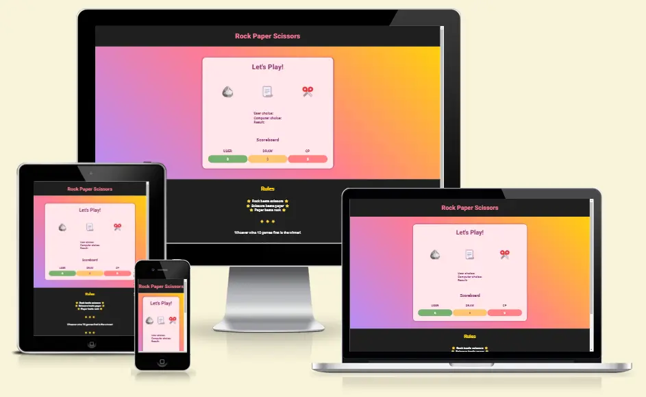

# Rock Paper Scissors Game

[Rock Paper Scissors Game](https://radule90.github.io/CI_PP_2/) is a simple game. Where the user chooses his choice and immediately receives a random response from the opponent (computer) together with the result of the game. The winner is decided by the number of wins, the first to win 10 times is the winner of the game.

***
## Table of Contents
1. 

    
<a href="#ux">UX</a>

      - [Visitor Goals](#visitor-goals)
      - [Business Goals](#business-goals)
      - [User Stories](#user-stories)

2. 

    
<a href="#visual-design">Visual Design</a>

      - [Wireframes](#wireframes)
      - [Colors](#colors)
      - [Fonts](#fonts)
      - [Icons](#icons)
      - [Images](#images)

3. 

    
<a href="#styling-formating-and-features">Styling, Formating and Features</a>

      - [Head Section](#head-section)
      - [Header Section](#header-section)
      - [About Section](#about-section)
      - [Blog Section](#blog-section)
      - [Gallery Section](#gallery-section)
      - [Connect Section](#connect-section)
      - [Footer Section](#footer-section)
      - [HTTP 404 Page](#http-404-page)
      - [Future Features](#future-features)

4. 

    
<a href="#validation-and-testing">Validation and Testing</a>

    <ul>
    <li><a href="#html-validation">HTML Validation</a></li>
    <li><a href="#css-validation">CSS Validation</a></li>
    <li><a href="#accessibility">Accessibility</a></li>
    <li>
      

      
<a href="#testing">Testing</a>

      - [General Testing](#general-testing)
      - [Desktop Testing](#desktop-testing)
      - [Mobile](#mobile-testing)

      

    </li>
    <li>
      

      
<a href="#bugs">Bugs</a>

      
      - [Fixed Bugs](#fixed-bugs)
      - [Unfixed Bugs](#unfixed-bugs-partialy-fixed)
      

    </li>
    </ul>    

  
5. <a href="#deployment">Deployment</a> 
6. <a href="#credits">Credits</a>
7. <a href="#tools-and-platforms">Tools and Platforms</a>
8. <a href="#content">Content</a>
9. <a href="#media">Media</a>

***
## UX
### Visitor Goals

### Business Goals

### User Stories

***
## Visual Design
### Wireframes

### Colors

### Fonts

### Icons

### Images

***
## Styling, Formating and Features

### Head Section

### Header Section

### About Section
 

### Blog Section

### Gallery Section

### Connect Section

### Footer Section

### HTTP 404 Page

### Future Features

***
## Validation and Testing
### HTML Validation

### CSS Validation

### Accessibility

### Testing
#### General Testing

#### Desktop Testing
.

#### Mobile Testing

### Bugs
### Fixed Bugs

### Unfixed Bugs (Partialy Fixed)

***
## Deployment

***
## Credits

***
## Tools and Platforms
- [Gitpod](https://gitpod.io/) - IDE for project development
- [Github](https://github.com/) - Storing code remotely and deployment
- [JSHint](https://jshint.com/) - JSHint, a JavaScript Code Quality Tool
- [W3C Markup Validation Service](https://validator.w3.org)
- [W3C CSS Validation Service](https://jigsaw.w3.org/css-validator/)
- [CSS Autoprefixer](https://autoprefixer.github.io/) - Autoprefixer CSS online
- [Coolors.co](https://coolors.co/) - Palette generator
- [Balsamiq Wireframes](https://balsamiq.com/) - To create wireframes
- [WebAIM](https://webaim.org/resources/contrastchecker/) - Contrast checker
- [Am I Responsive](https://ui.dev/amiresponsive) - For device mockup images
- [Favicon Generator](https://www.favicon-generator.org/)
- [BrowserStack](https://www.browserstack.com/) - Testing on different devices
- [Google Fonts](https://fonts.google.com)
- [Get Emoji](https://getemoji.com/) - Icons/Emojis
- [FireShot: Full Webpage Screenshots + Annotations](https://getfireshot.com/) - Screen Capture

***
## Content

***
## Media
