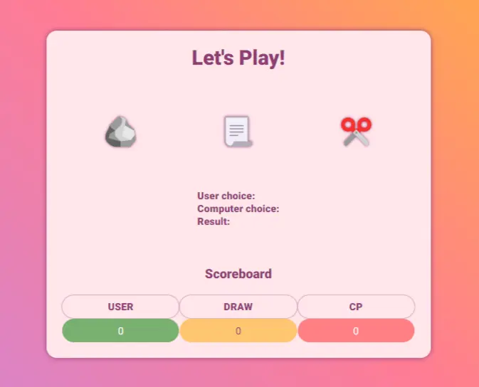
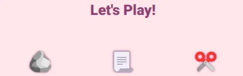
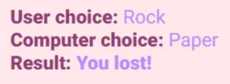
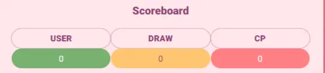
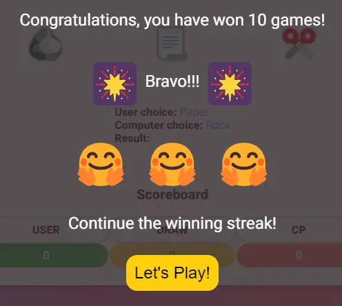
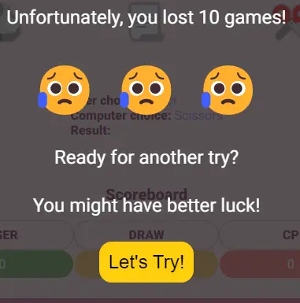
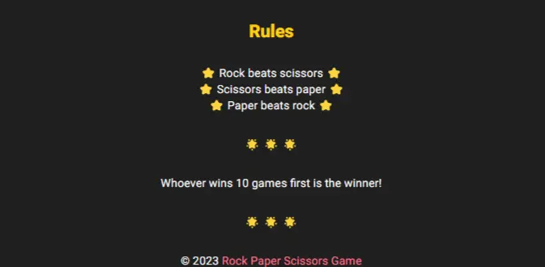
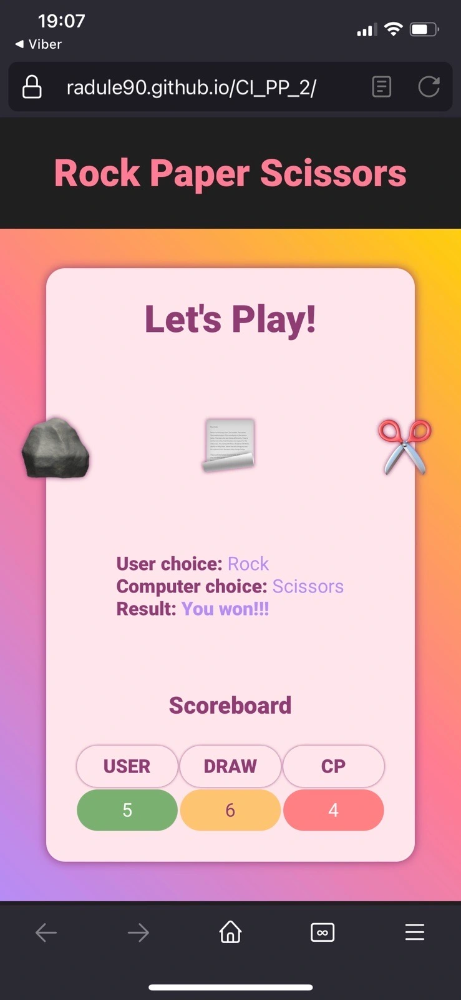
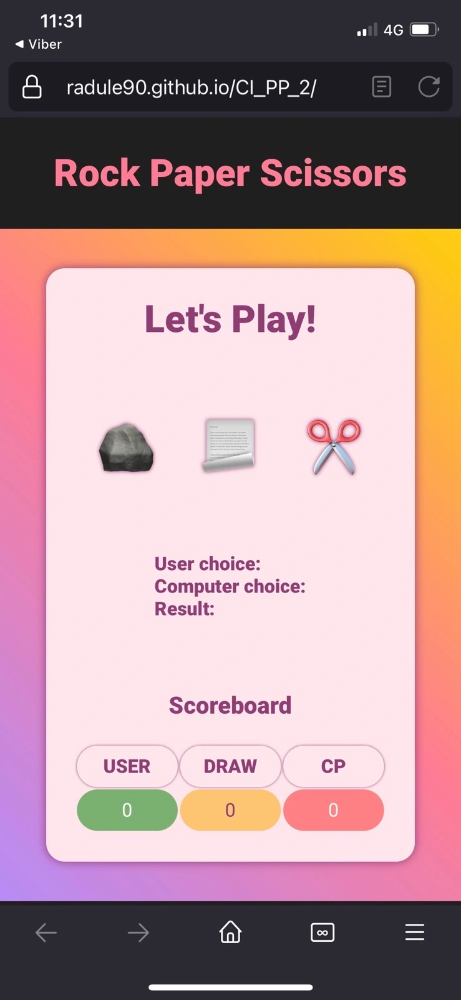

# Rock Paper Scissors Game


[Rock Paper Scissors Game](https://radule90.github.io/CI_PP_2/) is a simple game. Where the user chooses his choice and immediately receives a random response from the opponent (computer) together with the result of the game. The winner is decided by the number of wins, the first to win 10 times is the winner of the game.


***
## Table of Contents
1. <details>
    <summary><a href="#ux">UX</a></summary>

      - [Visitor Goals](#visitor-goals)
      - [Business Goals](#business-goals)
      - [User Stories](#user-stories)

</details>

2. <details>
    <summary><a href="#visual-design">Visual Design</a></summary>

      - [Wireframes](#wireframes)
      - [Colors](#colors)
      - [Fonts](#fonts)
      - [Icons](#icons)

</details>

3. <details>
    <summary><a href="#styling-formating-and-features">Styling, Formating and Features</a></summary>

      - [Head Section](#head-section)
      - [Header Section](#header-section)
      - [Game Section](#game-section)
      - [Footer Section](#footer-section)
      - [HTTP 404 Page](#http-404-page)
      - [Future Features](#future-features)

</details>

4. <details>
    <summary><a href="#validation-and-testing">Validation and Testing</a></summary>
    <ul>
    <li><a href="#validation-table">Validation</a></li>
    <li><a href="#accessibility">Accessibility</a></li>
       <li>
      <details>
      <summary><a href="#testing">Testing</a></summary>

      - [General Testing](#general-testing)
      - [Desktop Testing](#desktop-testing)
      - [Mobile](#mobile-testing)

      </details>
    </li>
    <li>
      <details>
      <summary><a href="#bugs">Bugs</a></summary>
      
      - [Fixed Bugs](#fixed-bugs)

      </details>
    </li>
    </ul>    

</details>
  
5. <details>
    <summary> <a href="#deployment">Deployment</a></summary>

      - [Github Deployment](#github-deployment)
      - [Local Deployment](#local-deployment)

</details> 

6. <a href="#credits">Credits</a>
7. <a href="#tools-and-platforms">Tools and Platforms</a>
8. <a href="#content">Content</a>
9. <a href="#media">Media</a>


***
## UX
### Visitor Goals
Target audience for this website:  
- Anyone who wants some short, simple fun with a classic game
- To play the entire game in just a few seconds or to repeat it multiple times

### Business Goals
This site / application is of a fun character, and its scope is insufficient for a business model, but as a fun addition to a larger site to entertain the user, it is possible.

### User Stories
Simple website / application, which simply serves to entertain the user, which can last one or more games or even several rounds.

***
## Visual Design
### Wireframes
- Initial [Wireframes](assets/img/readme/wireframes/) design.

### Colors
- Since this game is basically simple, I wanted to add to the dynamism of the site with various colors for fonts/backgrounds and sharper transitions between sections.
- As a result, you may see different shades of pink/purple, yellow, black and red.
- However, I made sure that everything was readable.
- Colour contrast was first verified on [WebAIM](https://webaim.org/resources/contrastchecker/).  


### Fonts
- I used a lot of different colors for the background and the letters, so I decided on just one font: Roboto from [Google Fonts](https://fonts.google.com/specimen/Roboto?query=roboto).
- This font is quite clear, legible, simple but still looks cool.  


### Icons
- Icons, or rather emojis, used on the site are taken from [Get Emoji](https://getemoji.com/).
- They seemed very interesting, even though they are displayed differently on different devices/applications, which can be annoying, but again, I think all of their variants look nice.  

- I also used the rock, paper, scissors emojis to create a favicon with the help of [GIMP](https://www.gimp.org/) and [Favicon Generator](https://www.favicon-generator.org/).  


***
## Styling, Formating and Features
- In HTML I have used semantic elements in appropriate places and HTML entities. Whereas I used div (non-semantic) elements as container for layout and positioning.
- I did most of the positioning with Flexbox (learnd at [CSS-Tricks](https://css-tricks.com/snippets/css/a-guide-to-flexbox/)), while I feel comfortable working with it.
- By combining the width in percentages and the maximum width in absolute units (pixels), Flexbox and thanks to the limited content of the header and footer, I achieved a responsive site without using media queries.
- For JavaScript, I wrote a flowchart on paper and tried to follow. Thanks to the resources listed in [Content Section](#content), I was able to achieve everything I set out to do ([In more detail.](#game-section)).
- I am aware that the code could be reduced and reshaped, to be more abstract. But because I'm still in the process of learning, I left it more verbose.

### Head Section
- For meta data I added character set, keywords, description, viewport, linked CSS and JavaScript file.
- I also added a favicon. I used the rock, paper, scissors emojis from [Get Emoji](https://getemoji.com/) to create a favicon with the help of [GIMP](https://www.gimp.org/) and [Favicon Generator](https://www.favicon-generator.org/).
- And title for page.

### Header Section
- I decided on a very simple header containing the title of the game which is also a link to the main page.
- The combination of shades of black and pink seemed to me an interesting choice for the header.
- Due to little content and centered text, the header is responsive.


### Game Section
- Classic Rock Paper Scissors vs Computer (CP) game, where the user chooses his choice and immediately receives a random response from the opponent (computer) together with the result of the game. The winner is decided by the number of wins, the first to win 10 times is the winner of the game.  
  
- A small title "Let's Play!", which suggests that the user can start playing right away.  
  
- Then there are three possible choices for the user to choose from and that's where I applied JavaScript for the first time, adding event listeners for all three options so that when one of the possible choices is clicked, it is immediately written in the User's choice field (using the element proporty of innerHTML) and the following functions are launched.  
  
- A random choice computer function, where I used methods of the Math object and switch statements to assign values to random numbers. At first I thought to do it using if statements, but for the sake of practice I decided to use switch. And the selection is entered in the corresponding field (using the element proporty of innerHTML).
- It is immediately followed by a function that determines the winner with if else statements, there are better solutions, but I decided on this one, even though it is verbose, it is currently the most readable for me. Result is entered in the corresponding field (using the element proporty of innerHTML).  
  
- I decided to display the results using a table elements of HTML, it seemed logical to me to use because it is tabular data.
- Also a fairly simple solution for counting the score with the help of a simple function that recognizes winner/loser/tie messages with if else statements and increments score.
- To determine the final winner, I created a function that simply checks with if else statements whether the user or the computer has reached 10 wins. And if it is, JavaScript changes the style of the display element to block so that the corresponding message (winner or loser) appears.  
  
  
- For the messages, I decided to make the background a transparent black shade so that the game background is partially visible. The text is white, I think it's the most legible. I also added a link to start a new game and styled it using the colors from the palette.
- Just as I tried to make the entire java script simple, so here I tried to click on the message button with a simple onclick event to trigger a function that returns the display state of the message to none, in order to remove
- Immediately after that, the last function, which is called as part of the function to check the final winner, is started, which returns the state of the variables to empty strings and 0, resets the game.

### Footer Section
- For the footer section I chose the same background color as for the header, because it is drastically different from the game area.
- I decided to put the short rules of the game in the footer. I thought about making a separate card with the rules, but somehow it seemed to me that this solution was quite simple in line with the whole site. I emphasized the importance of the title in yellow, while the rest of the text was written in white.
- Due to the centered text and content width, the footer is also responsive.
- I included a copyright text in it with pink colored link to repositary of this game.  


### HTTP 404 Page
- As a small addition I designed and developed an 404 HTTP error page.
- I kept the header and footer of the main page, without Rules of the game in footer section.
- I didn't want to be it too complicated, because there should be a simple message on this page. Using the same color palette and fonts I added an error message card and an additional link to the main page.


- [Here you can find broken link as example for 404 page.](https://radule90.github.io/CI_PP_2/11)

### Future Features
- As I said, the code needs to be reformatted, use the ternary operator, write it more abstractly, but these are upgrades that will follow in the future.
- Adding additional choices (Lizard, Spock)
- Instead of text display of results, animations
- Game between two users

***
## Validation and Testing
### Validation Table


 <table>
   <thead>
     <tr>
       <th></th>
       <th><a href="https://validator.w3.org">HTML Validation</a></th>
       <th><a href="https://jigsaw.w3.org/css-validator/">CSS Validation</a></th>
       <th><a href="https://jshint.com/">JSHint</a></th>
       <th><a href="https://developer.chrome.com/docs/lighthouse/overview/">Google Chrome Lighthouse</a></th>
     </tr>
   </thead>
   <tbody>
     <tr>
       <th>Mobile</th>
       <td>No errors or warnings to show.</td>
       <td>Congratulations! No Error Found.</td>
       <td>
         <ul>
           <li>There are 8 functions in this file.</li>
           <li>Function with the largest signature take 1 arguments, while the median is 0.</li>
           <li>Largest function has 12 statements in it, while the median is 6.5.</li>
           <li>The most complex function has a cyclomatic complexity value of 14 while the median is 3.</li>
         </ul>
       </td>
       <td>
         <table>
           <tr>
             <th>Performance</th>
             <td>99</td>
           </tr>
           <tr>
             <th>Accessibility</th>
             <td>100</td>
           </tr>
           <tr>
             <th>Best Practices</th>
             <td>100</td>
           </tr>
           <tr>
             <th>SEO</th>
             <td>100</td>
           </tr>
         </table>
       </td>
     </tr>
     <tr>
       <th>Computer</th>
       <td>No errors or warnings to show.</td>
       <td>Congratulations! No Error Found.</td>
       <td>Same as above</td>
              <td>
         <table>
           <tr>
             <th>Performance</th>
             <td>100</td>
           </tr>
           <tr>
             <th>Accessibility</th>
             <td>100</td>
           </tr>
           <tr>
             <th>Best Practices</th>
             <td>100</td>
           </tr>
           <tr>
             <th>SEO</th>
             <td>100</td>
           </tr>
         </table>
       </td>
     </tr>
     <tr>
       <th>Mobile (404 Page)</th>
       <td>No errors or warnings to show.</td>
       <td>Congratulations! No Error Found.</td>
       <td>Same as above</td>
              <td>
         <table>
           <tr>
             <th>Performance</th>
             <td>99</td>
           </tr>
           <tr>
             <th>Accessibility</th>
             <td>100</td>
           </tr>
           <tr>
             <th>Best Practices</th>
             <td>100</td>
           </tr>
           <tr>
             <th>SEO</th>
             <td>100</td>
           </tr>
         </table>
       </td>
     </tr>
     <tr>
       <th>Computer (404 Page)</th>
       <td>No errors or warnings to show.</td>
       <td>Congratulations! No Error Found.</td>
       <td>Same as above</td>
              <td>
         <table>
           <tr>
             <th>Performance</th>
             <td>100</td>
           </tr>
           <tr>
             <th>Accessibility</th>
             <td>100</td>
           </tr>
           <tr>
             <th>Best Practices</th>
             <td>100</td>
           </tr>
           <tr>
             <th>SEO</th>
             <td>100</td>
           </tr>
         </table>
       </td>
     </tr>
   </tbody>
 </table>

### Accessibility
- Color contrast was verified on [WebAIM](https://webaim.org/resources/contrastchecker/).
- Results from Google Lighthouse Accessibility can be found above in the [Validation Table](#validation-table).


### Testing
#### General Testing
- The app works well on all tested devices, mostly Windows and Android.
- All functions work properly, the site is responsive even though no media queries were used
- The application showed no errors in increasing the score, checking the final winner, resetting, it works without errors.
- Since emoji are unicode, they display differently on different software / devices, but this is not a bug, but normal behavior.

#### Desktop Testing
- It was tested on several Windows computers by acquaintances and friends, worked without errors.
- The site was tested on a macOS computer and performed very well

#### Mobile Testing
- It has been successfully tested on multiple android devices and also on multiple virtual devices at [BrowserStack](https://www.browserstack.com/).
- It has been tested on ios devices, a [bug](#fixed-bugs) was found with the layout which has been fixed, now it works fine

### Bugs
### Fixed Bugs
- Chrome Lighthouse was returning manifest errors, so I found [this solution](https://github.com/jantimon/favicons-webpack-plugin/issues/212).
- iOS bug with emoji flexbox layout, although on android devices everything worked as it should, on ios there was the following problem  

i have fixed with flexbox property `align-self: center;`, thanks to [CSS-Tricks](https://css-tricks.com/snippets/css/a-guide-to-flexbox/).  

***
## Deployment
### Github Deployment
This site was deployed through GitHub Pages using the following steps:
1. Sign in to the GitHub website.
2. In the GitHub project repository, navigate to the Settings tab, then choose Pages from the menu
3. From the Build and deployment section select Branch: main and then save.
4. After about a minute, refresh the page and under GitHub Pages you will see a link.

The live link can be found here: [Rock Paper Scissors Game](https://radule90.github.io/CI_PP_2/).

### Local Deployment
#### Requirements
- An IDE of your choice ([Visual Studio Code](https://code.visualstudio.com/))
- [Git](https://git-scm.com/)

#### How to Clone
1. Go to the repository of [project](https://github.com/radule90/CI_PP_2)
2. Click on the Code button above the list of files
3. Choose one of remote URL: HTTPS, SSH, GitHub CLI and click the copy button or download a copy of the [project repository](https://github.com/radule90/CI_PP_2/archive/refs/heads/main.zip) and extract the zip file to your base folder.
4. In your IDE Terminal change the current working directory to the one where you want the clone
5. Type following code (for example is used GitHub CLI URL) in Git Bash/Terminal of IDE and press Enter:  

     ```
     git clone https://github.com/radule90/CI_PP_2.git
     ```
6. You can run the project by dropping index.html into a web browser or if you have Python installed, run it on an HTTP server with Python with a command such as:

    ```
    python3 -m http.server
    ```

#### How to Fork
1. Go to the repository of [project](https://github.com/radule90/CI_PP_2)
2. Bellow navigation bar on the top of the page in right corner you will locate Fork button
3. When clicked, you should have a copy of repository in your GitHub

***
## Credits
- [Code Institute](https://codeinstitute.net/de/)
- Rory Patrick Sheridan (Mentor) - Great advice and guidance
- [Mozilla Developer Networks](https://developer.mozilla.org/en-US/) - Additional learning resources
- [W3Schools](https://www.w3schools.com) - Additional learning resources
- [CSS-Tricks](https://css-tricks.com) - Additional learning resources
- [Dave Gray](https://www.youtube.com/c/DaveGrayTeachesCode) - Additional learning resources
- [Kevin Powell](https://www.youtube.com/@KevinPowell) - Additional learning resources
- [BrowserStack](https://www.browserstack.com/) - Website Testing on iOS

***
## Tools and Platforms
- [Gitpod](https://gitpod.io/) - IDE for project development
- [Github](https://github.com/) - Storing code remotely and deployment
- [JSHint](https://jshint.com/) - JSHint, a JavaScript Code Quality Tool
- [W3C Markup Validation Service](https://validator.w3.org)
- [W3C CSS Validation Service](https://jigsaw.w3.org/css-validator/)
- [CSS Autoprefixer](https://autoprefixer.github.io/) - Autoprefixer CSS online
- [Coolors.co](https://coolors.co/) - Palette generator
- [Balsamiq Wireframes](https://balsamiq.com/) - To create wireframes
- [WebAIM](https://webaim.org/resources/contrastchecker/) - Contrast checker
- [Am I Responsive](https://ui.dev/amiresponsive) - For device mockup images
- [Favicon Generator](https://www.favicon-generator.org/)
- [BrowserStack](https://www.browserstack.com/) - Testing on different devices
- [Google Fonts](https://fonts.google.com)
- [Get Emoji](https://getemoji.com/) - Icons/Emojis
- [FireShot: Full Webpage Screenshots + Annotations](https://getfireshot.com/) - Screen Capture
- [cloudconvert](https://cloudconvert.com/png-to-webp) - Online png to webp converter
- [GIMP](https://www.gimp.org/) - Raster graphics editor

***
## Content
- The following three tutorials helped me arrive at the final code solution
    - [3 ways to code Rock Paper Scissors in JavaScript (Beginner to Intermediate to Advanced!)
    ](https://www.youtube.com/watch?v=RwFeg0cEZvQ)
    - [A game of Rock Paper Scissors written in JavaScript ✋
    ](https://www.youtube.com/watch?v=n1_vHArDBRA)
    - [Web Development Tutorial - JavaScript, HTML, CSS - Rock Paper Scissors Game
    ](https://www.youtube.com/watch?v=jaVNP3nIAv0)
- Thanks to them for the amazing tutorials!!!

***
## Media
- Decorative icons/emojis are taken from [Get Emoji](https://getemoji.com/)